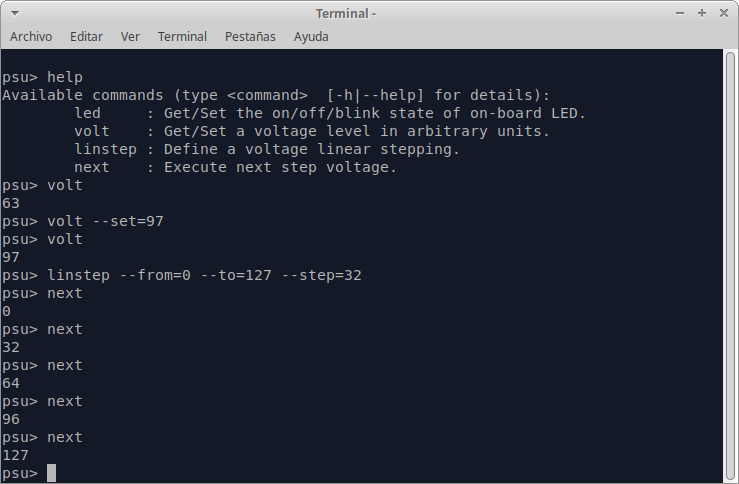

# PICO-PSU
A programmable constant current power supply.

# Description
This hardware/firmware project was born from the need to provide calibration LEDs with a constant current power supply for TESS-W calibration purposes.
However, the constant current source is programmable so that we can test photometers at low and high light levels.

## Hardware

The schematics below shows a PWM signal taken from a [Raspbberry Pi Pico](https://www.raspberrypi.com/documentation/microcontrollers/raspberry-pi-pico.html) microcontroller board. This is low-pass filtered by R1 (10Kohms) and C1 (10uF), which produces a DC signal proportional to the ON part of the duty cycle from the minimun voltage (0.2 mV) output from the pin to the max voltage (3.27 V). This signal is buffered through a voltage follower (U1) and then fed to a constant current circuit built around another op-amp (U2) and a typical NPN transistor U3.


***Design note***: *Both U1 and U2 could be merged into a single op-amp.The actual chip provides with 4 op-amps, so there is no practical waste of hardware. For practical reasons, I tested each stage separately, decided not to apply any gain in U1 and used a new stage using U2.*

The PWM square signal output is generated  from the microcontroller using one of its PWM modules with a 16-bit counter. 
The `TOP` register set to 126 (yes, 126) with no phase correction, yielding the following ranges:

- 0 => 0% duty cycle
- 127 => 100% duty cycle

This is an effective 7-bit resolution, more than enough for our purposes. The PŴM module prescaler is set to 125 so as not to produce a very high frequency square wave. The resulting frequency is around 7874 Hz. This signal is heavily filtered with a first order low pass filter, whose cut-off frequency is $f_c = 1/(2\pi R_1C_1) = 1.59 Hz$. This filters out the fundamental frequency and harmonics, showing negligible ripple.

The constant current circuit is based on the principle of op-amp (U2) maitaining a constant voltage across R2 by its inverting input. 
This constant voltage translates into a $I_e$ emitter constant current flowing from the NPN transistor U3, thus forcing a constant current $I_c$ through its collector no matter the load connected to the collector (a LED in this case) as long as the transistor U3 does not enter into saturation.


Figures 1 & 2 shows the experimental measurements using Pico's `VSYS` output as $V_{CC} = 4.94V$. It shows that the current flowing through the LED is proportional to the ON part of the square waveform until it reaches the saturation regime of transistor U3 at the ON counter value of 114. At this point, U3 $V_ {CE}$ voltage remains constant at a saturation value of 139 mV. Changing the R2 resistor value to a slightly bigger value (1k2) probably will make the whole range linear.

 
Figure 3 shows the prototyped circuit in a protoboard. All op-amps are from the same LM324N chip, which accepts single supply rail lines. This is very convenient since we are dealing with unipolar signals (no negative voltages).

# Firmware
The firmware was writting using [FreeRTOS](https://www.freertos.org/), as a first contact with this micro-kernel.

Figure 4 below shows the software architecture in terms of FreeRTOS tasks. The FreeRTOS notifications mechanism is used as a quick way to send
commands to tasks. Commands with arguments are packed into 32 bit integers. The `linstep` command actually sends three notifications, as the
parameters do not fit into a single 32 bit word.


Each task must define a `vXXXTaskSetup()` which actually executes before the FreeRTOS tasking system is started. 
This function typically initializes hardware and software resources *and also registers supported commands* to the console task.

## Console commands

The following commands are supported:
```
psu> help
Available commands (type <command>  [-h|--help] for details):
        led     : Turns on/off blinking of on-board LED.
        volt    : Get/Set a voltage level in arbitrary units.
        linstep : Define a voltage linear stepping.
        next    : Execute next step voltage.
``` 

Figure 5 shows the interactive definition and exectution of `linstep` and `ǹext`commands.



## Acknowledgements
Besides [FreeRTOS](https://www.freertos.org/), this firmware has used the following valuable libraries:
* [The C Macro Collections project](https://github.com/LeoVen/C-Macro-Collections). A STL-like library for C developers. Based heavily on macros, almost all documents except one example are all outdated. But still worth it.
* [The linenoise library](https://github.com/antirez/linenoise). A simple, vt100-like library to implement consoles. Still, very heavy for microcontroller development. I have stripped it to a bare minimun: dumb mode only, no history, no editing. I have also modified the sources to use FreeRTOS heap memory management.
* [Argtable 2](https://github.com/jonathanmarvens/argtable2). Argument parsing library to implement commands with options. Slightly modified to use  FreeRTOS heap memory management and `float` command parsing.